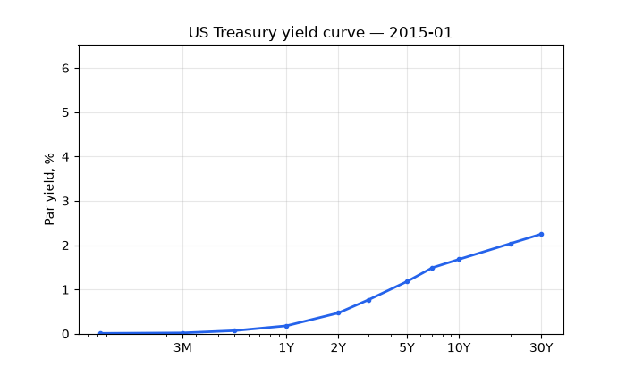
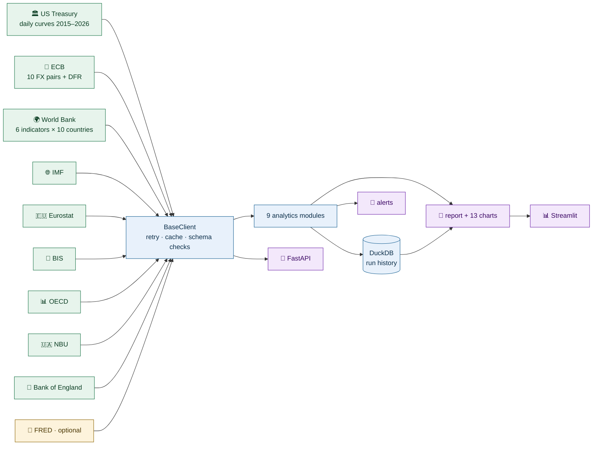

<div align="center">

# 📈 Macro Pulse

### Yield curves, FX and country stress from ten official statistical APIs — no keys, no scraping, refreshed by CI every weekday morning


<a href="#-quick-start">Quick start</a>
&nbsp;·&nbsp; <a href="#-what-the-detection-actually-finds">What it finds</a>
&nbsp;·&nbsp; <a href="#-the-analytics">The modules</a>
&nbsp;·&nbsp; <a href="#-automation">Automation</a>
&nbsp;·&nbsp; <a href="#-data-provenance">Provenance</a>



<sub>*139 monthly frames of the Treasury curve, straight from the cached
official data. The line goes red whenever 10Y−3M is inverted. Made by
`scripts/make_curve_gif.py`.*</sub>

</div>

The idea is simple: central banks and statistical offices publish a lot of
good data for free, and most projects still go through paid aggregators to
get it. Macro Pulse goes to the primary sources directly — the US Treasury,
ECB, World Bank, IMF, Eurostat, BIS, OECD, the National Bank of Ukraine
and the Bank of England — caches every raw response, and builds a monitor
report on top: curve inversions, FX volatility and real (CPI-adjusted)
exchange rates, a per-country stress index, event studies around FOMC and
ECB decisions, a debt sustainability screen, a small nowcast and a signal
backtest.

After the first refresh the cache holds about 2,900 trading days of
Treasury curves, 29,000+ ECB fixings across ten pairs, BoE rates back to
2000, and monthly panels from the rest. A scheduled GitHub Action re-pulls
everything on weekday mornings and commits the result only when something
actually changed. There's also a DuckDB file that keeps a row per run, so
over time the stress index gets its own history instead of being a
point-in-time snapshot.

> [!NOTE]
> Three repos shaped how this one is put together: the source discipline
> of [public-apis](https://github.com/public-apis/public-apis), the
> tear-sheet idea from
> [quantstats](https://github.com/ranaroussi/quantstats), and the habit of
> writing decisions down from
> [system-design-primer](https://github.com/donnemartin/system-design-primer).
> The decisions themselves are in [`docs/adr/`](docs/adr/) — seven short
> files, one per choice that wasn't obvious.

## 🔁 The pipeline at a glance



<sub>🟢 keyless official sources &nbsp; 🟡 optional, needs a free key &nbsp;
🔵 pipeline &nbsp; 🟣 outputs</sub>

---

## ⚡ Quick start

```bash
git clone https://github.com/yaroslavdeineka/macro-pulse.git
cd macro-pulse
pip install -r requirements.txt

python -m pytest tests/ -q       # 33 tests, all offline
python run_monitor.py            # report from the shipped cache
python run_monitor.py --refresh  # live pull from all ten sources
```

> [!TIP]
> The repo ships with a real Treasury snapshot, so the curve sections, the
> event study, the nowcast and the backtest work with no network at all.
> The rest fills in after the first `--refresh`. Countries, currencies,
> date ranges and thresholds sit in `config.yaml`, not in code.

The dashboard and the API are optional and have their own requirements
file: `pip install -r requirements-extras.txt`, then
`streamlit run app/streamlit_app.py` or `python api/main.py` (interactive
docs at `/docs`).

## 🔍 What the detection actually finds

No dates are hard-coded anywhere in the analytics. Everything below comes
out of the episode detection and the event windows on their own:

| | |
|---|---|
| 2019 | three short 10Y−3M inversions between March and October, min −52 bp — the pre-COVID warning shot |
| Feb–Mar 2020 | a 10-day inversion around the COVID panic |
| 2022–2024 | the big one: **534 trading days** inverted, bottom at **−189 bp**, un-winding on 2024-12-12 |
| Ukraine | the two wartime UAH re-pegs (29.25, then 36.57) show up as flat steps in the NBU panel; M3 grows ~15% YoY |
| FOMC days | single decisions moved the spread by up to 39 bp within a ±3-day window |
| FX pairs | NOK and SEK move together (+0.48 on daily changes), so do HUF/PLN and CHF/JPY |


<sub>*Every trading day 2015–2026 against every tenor. The COVID valley,
the 2023 plateau and the inversion are visible without annotations.*</sub>


<sub>*23 daily series from three unrelated sources. Numbers are only
printed where |r| ≥ 0.20 — most of the matrix is noise and admitting that
makes the real clusters easier to see.*</sub>


<sub>*Official NBU data. Worth knowing: before 2020 the API quotes UAH per
100 USD, after — per 1. The chart looked absurd until the parser learned
that; there's a test now so it stays learned.*</sub>

## 🧭 The analytics

| # | Module | The question | How |
|---|--------|-------------|-----|
| 01 | `yield_curve` | is the curve inverted, since when, how deep | run-length grouping over sign flips |
| 02 | `fx` | which currency is under pressure vs EUR | rolling vol, drawdowns, z-scores |
| 03 | `real_fx` | is the move real or just inflation differentials | ECB FX deflated by World Bank CPI |
| 04 | `scorecard` | which economy is unusual vs its own past | per-country z-scores → stress index |
| 05 | `events` | do policy decisions move the curve | ±3-day windows around 32 FOMC/ECB dates |
| 06 | `debt` | who grows out of debt and who doesn't | the textbook r-vs-g check |
| 07 | `correlations` | what moves together, and when | Pearson on daily changes + rolling window |
| 08 | `nowcast` | where is the spread heading short-term | Holt smoothing vs a naive benchmark |
| 09 | `backtest` | was the inversion signal worth trading | CAGR / Sharpe / drawdown tear sheet |

> [!IMPORTANT]
> About the backtest: official sources publish yields, not returns, so
> bond P&L is simulated with a constant-duration approximation and the
> signal is lagged a day (details in ADR-0007). On 2015–2026 the result is
> that plain cash beat both the strategy and buy-and-hold — rates were
> rising most of the decade. The report prints that instead of hiding it,
> which I'd argue is the more useful demo.

## ⏱️ Three bits of code worth showing

Inversion episodes without a single hard-coded date
([`yield_curve.py`](src/analytics/yield_curve.py)) — group id increments
on every sign flip, contiguous negative runs become episodes:

```python
below = spread < 0
group = (below != below.shift()).cumsum()
for _, chunk in spread.groupby(group):
    if (chunk < 0).all() and len(chunk) >= min_days:
        episodes.append({"start": chunk.index.min().date(), ...})
```

Schema checks at the parser, not downstream
([`schemas.py`](src/schemas.py)) — when a source renames a column, the
error names the source instead of surfacing as a KeyError three modules
later:

```python
return validate(df, "yield_curve", "ustreasury")
```

Sections fail independently ([`run_monitor.py`](run_monitor.py)) — with
ten sources, something is always down; a dead API costs one section, not
the report:

```python
for name, fn in SECTIONS:
    try:
        fn(args, sections, ctx)
    except (SourceUnavailable, Exception) as exc:
        skipped.append(name)
```

## 🤖 Automation

| | What | How |
|---|---|---|
| ✅ | weekday self-refresh | `refresh.yml` pulls all sources at 06:30 UTC and commits `data/` + `outputs/`, but only if the content changed |
| ✅ | CI on every push | pytest on 3.10/3.11/3.12, mypy, and a full smoke run from the shipped cache |
| ✅ | history, not snapshots | each run appends its headline numbers to `data/history.duckdb` |
| ✅ | alerts | Slack/Telegram webhooks (set via env vars) on an ongoing inversion or a stress-index breach |
| ✅ | containers | `docker compose up monitor` / `refresh` / `api` / `dashboard` |

One caveat, stated on purpose: commits made by the Actions bot don't show
up on a personal contribution graph. The claim here is "the repo updates
itself", nothing more.

## 🛰️ Data provenance

| Source | Feeds | Auth | Notes |
|---|---|---|---|
| [US Treasury](https://home.treasury.gov/policy-issues/financing-the-government/interest-rate-statistics) | daily par curves, 2015–2026 | none | cross-checked against their XML feed |
| [ECB](https://data.ecb.europa.eu/help/api/data) | 10 FX pairs since 2015, deposit facility rate | none | SDMX-CSV |
| [World Bank](https://datahelpdesk.worldbank.org/knowledgebase/articles/889392) | GDP, CPI, unemployment, debt, current account, real rate | none | 1990–2026, annual |
| [IMF](https://datahelpdesk.imf.org/knowledgebase/articles/667681) | monthly CPI | none | second SDMX provider, different wire format |
| [Eurostat](https://ec.europa.eu/eurostat/web/user-guides/data-browser/api-data-access) | monthly HICP | none | JSON-stat 2.0 |
| [BIS](https://stats.bis.org/api-doc/v1/) | credit-to-GDP gap | none | their own crisis early-warning series; experimental |
| [OECD](https://sdmx.oecd.org) | composite leading indicator | none | experimental |
| [NBU](https://bank.gov.ua/ua/open-data/api-dev) | UAH history, monetary aggregates | none | see the per-100-units quirk above |
| [Bank of England](https://www.bankofengland.co.uk/boeapps/iadb/) | Bank Rate since 2000 | none | endpoint has moved before; experimental |
| [FRED](https://fred.stlouisfed.org/docs/api/fred/) | US high-frequency series | free key | skipped entirely unless `FRED_API_KEY` is set |

"Experimental" means the endpoint has moved or blocked scripted clients at
some point in the past. Those sections are optional by design — a skipped
section in a CI-built report is the degradation model doing its job.

> [!WARNING]
> Why not Statista or Trading Economics? They resell the same primary data
> through an extra layer, behind terms that prohibit both scripted access
> and redistribution. For a public repo that's a dealbreaker; going to the
> source is also just more reliable.

## 📁 Repository structure

```
macro-pulse/
├── run_monitor.py            # orchestrator: 10 source + 8 derived sections
├── config.yaml               # countries · currencies · ranges · thresholds
├── src/
│   ├── clients/              # BaseClient + 10 source clients
│   ├── analytics/            # the 9 modules
│   ├── report.py             # 13 chart builders + markdown assembly
│   ├── schemas.py · history.py · alerts.py · config.py · logging_setup.py
├── app/streamlit_app.py      # dashboard (optional)
├── api/main.py               # JSON API (optional)
├── scripts/make_curve_gif.py # the animation at the top
├── .github/workflows/        # ci.yml + refresh.yml
├── docs/adr/                 # 7 decision records
├── data/cache/               # raw response bodies from the sources
├── data/history.duckdb       # one row per metric per run
├── outputs/                  # report, charts, GIF, logs
└── tests/                    # 33 offline tests
```

## ⚠️ Disclaimer

> [!WARNING]
> Educational / portfolio project, not investment advice. Cached snapshots
> are unmodified response bodies from the official sources; every future
> snapshot arrives through a public, dated CI commit. The backtest and the
> nowcast are methodology demos and say so in their own output.

---

<div align="center">

**Yaroslav Deineka** · MSc International Business with Business Analytics

[](https://www.linkedin.com/in/yaroslav-deineka-b91622323)
[](https://github.com/yaroslavdeineka)

<sub>If this repo taught you something, a ⭐ helps more people find it.</sub>

</div>
