# Macro Pulse — monitor report

## US Treasury yield curve
*Source: U.S. Department of the Treasury — daily par yield curve (2015-01-02 → 2026-09-01, 2918 trading days)*

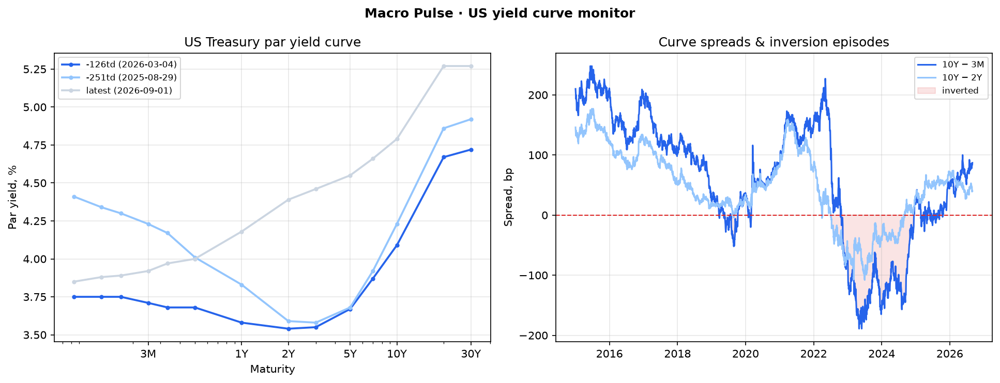

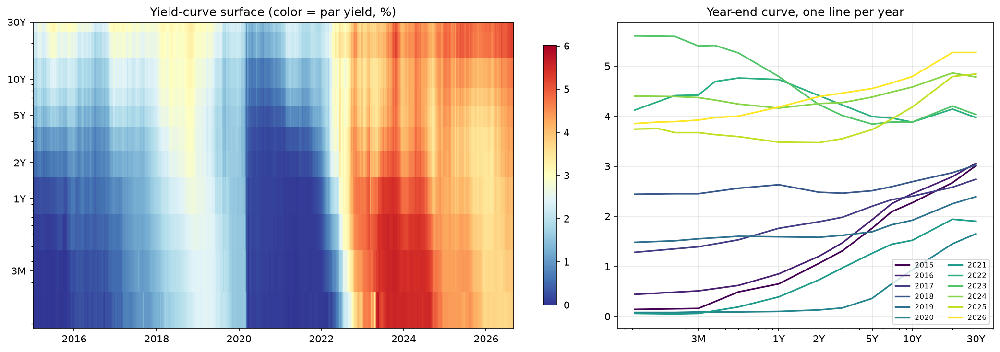

- Latest 10Y−3M spread: **87 bp**
- Latest 10Y−2Y spread: **40 bp**

**Inversion episodes detected (10Y−3M):**

| start      | end        |   trading_days |   min_bp |
|:-----------|:-----------|---------------:|---------:|
| 2019-03-22 | 2019-03-28 |              5 |       -5 |
| 2019-05-23 | 2019-07-22 |             41 |      -28 |
| 2019-07-24 | 2019-10-10 |             56 |      -52 |
| 2020-02-18 | 2020-03-02 |             10 |      -20 |
| 2022-10-25 | 2024-12-12 |            534 |     -189 |
| 2025-02-26 | 2025-03-21 |             18 |      -19 |
| 2025-03-28 | 2025-04-09 |              9 |      -27 |
| 2025-04-25 | 2025-05-01 |              5 |      -14 |
| 2025-06-11 | 2025-06-13 |              3 |      -10 |
| 2025-06-17 | 2025-07-07 |             13 |      -17 |
| 2025-07-21 | 2025-07-23 |              3 |       -6 |
| 2025-07-29 | 2025-08-14 |             13 |      -13 |
| 2025-08-22 | 2025-08-28 |              5 |       -4 |
| 2025-09-08 | 2025-09-15 |              6 |       -7 |

**Inversion episodes detected (10Y−2Y):**

| start      | end        |   trading_days |   min_bp |
|:-----------|:-----------|---------------:|---------:|
| 2019-08-27 | 2019-08-29 |              3 |       -4 |
| 2022-07-06 | 2024-08-26 |            537 |     -108 |

## FX & ECB policy
*Source: European Central Bank Data Portal — daily euro reference rates*

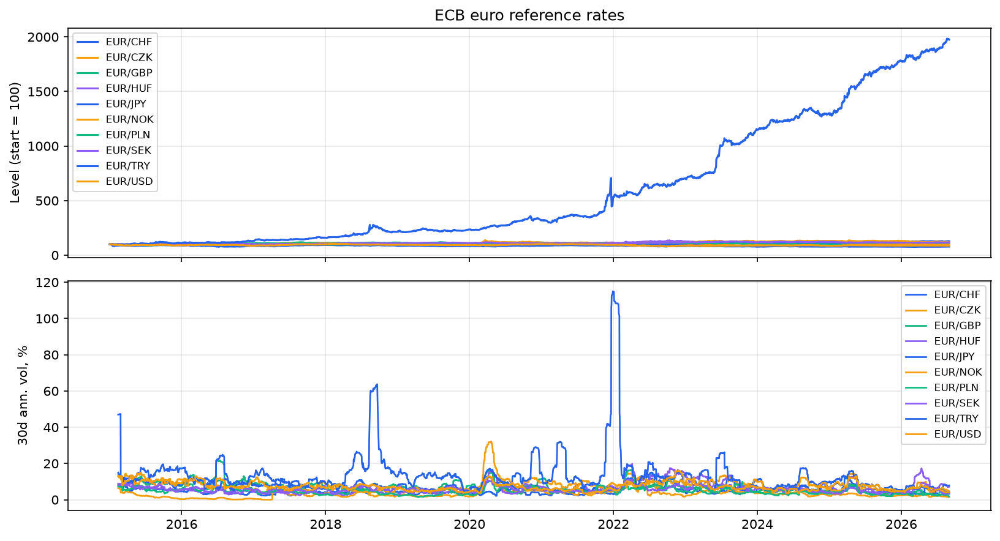

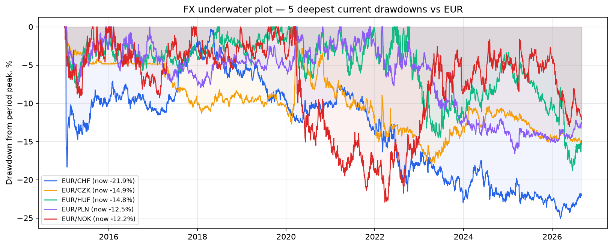

| currency   |   obs | first      | last       |   latest_rate |   period_change_pct |   ann_vol_30d_pct |   max_drawdown_pct |   level_zscore |
|:-----------|------:|:-----------|:-----------|--------------:|--------------------:|------------------:|-------------------:|---------------:|
| CHF        |  2986 | 2015-01-02 | 2026-09-01 |        0.9394 |              -21.86 |              3.25 |             -25.07 |          -1.36 |
| CZK        |  2986 | 2015-01-02 | 2026-09-01 |       24.159  |              -12.76 |              1.63 |             -18.07 |          -1.34 |
| GBP        |  2986 | 2015-01-02 | 2026-09-01 |        0.8566 |                9.81 |              1.66 |             -11.4  |           0.1  |
| HUF        |  2986 | 2015-01-02 | 2026-09-01 |      366.71   |               15.05 |              7.16 |             -18.84 |           0.44 |
| JPY        |  2986 | 2015-01-02 | 2026-09-01 |      185.63   |               27.84 |              7.89 |             -23.44 |           2.31 |
| NOK        |  2986 | 2015-01-02 | 2026-09-01 |       10.8185 |               19.65 |              4.76 |             -22.93 |           0.53 |
| PLN        |  2986 | 2015-01-02 | 2026-09-01 |        4.3313 |                0.6  |              3.38 |             -16.59 |          -0.24 |
| SEK        |  2986 | 2015-01-02 | 2026-09-01 |       11.1145 |               17.36 |              3.48 |             -12.24 |           0.95 |
| TRY        |  2986 | 2015-01-02 | 2026-09-01 |       55.9498 |             1874.79 |              4.45 |             -36.87 |           2.42 |
| USD        |  2986 | 2015-01-02 | 2026-09-01 |        1.159  |               -3.76 |              4.29 |             -23.44 |           0.71 |

- ECB deposit facility rate (latest): **2.25%** as of 2026-09-02

## Cross-country macro scorecard
*Source: World Bank — World Development Indicators (1990:2026); z-scores vs each country's own history*

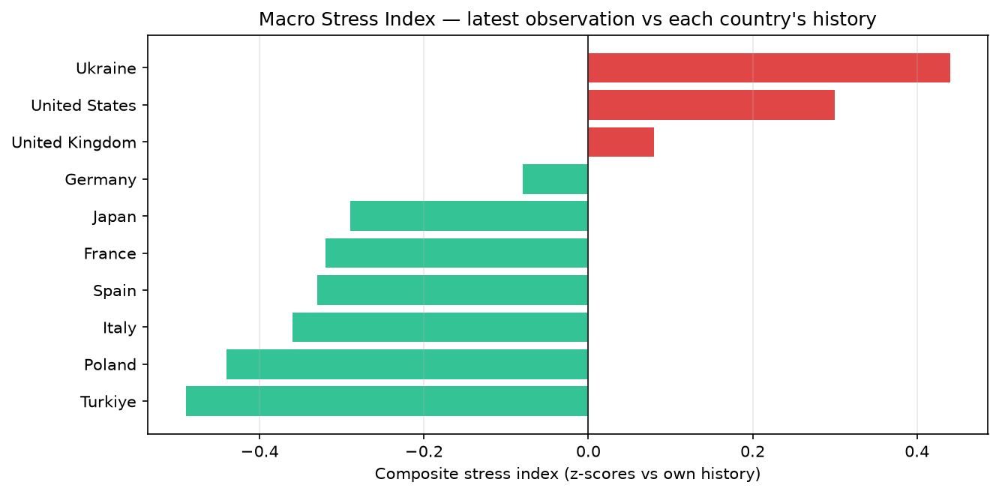

| country        |   gdp_growth_pct |   inflation_pct |   unemployment_pct |   govt_debt_gdp_pct |   stress_index |
|:---------------|-----------------:|----------------:|-------------------:|--------------------:|---------------:|
| Ukraine        |             1.82 |           12.73 |               9.83 |               58.72 |           0.44 |
| United States  |             2.16 |            2.95 |               4.2  |              115.77 |           0.3  |
| United Kingdom |             1.39 |            3.88 |               4.75 |              130.74 |           0.08 |
| Germany        |             0.24 |            2.17 |               3.71 |               20.85 |          -0.08 |
| Japan          |             1.19 |            3.17 |               2.45 |              nan    |          -0.29 |
| France         |             0.84 |            0.94 |               7.54 |              nan    |          -0.32 |
| Spain          |             2.82 |            2.7  |              10.38 |              105.64 |          -0.33 |
| Italy          |             0.54 |            1.53 |               6.39 |               77.29 |          -0.36 |
| Poland         |             3.57 |            3.81 |               2.98 |               60.45 |          -0.44 |
| Turkiye        |             3.6  |           34.88 |               8.52 |               26.62 |          -0.49 |

## UK policy rate (experimental source)
*Source: Bank of England IADB — Official Bank Rate (IUDBEDR)*

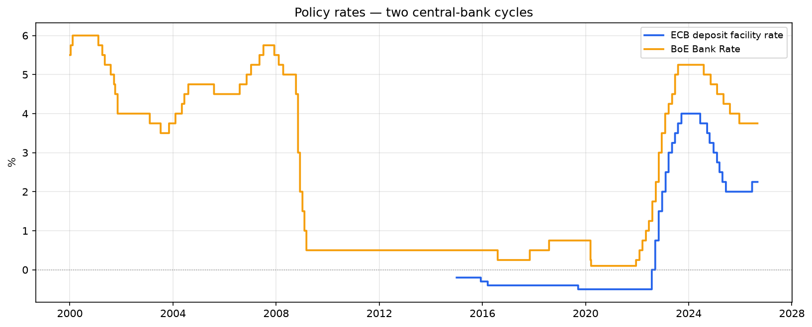

- Latest Bank Rate: **3.75%** as of 2026-09-01 (6737 observations since 2000-01-04)

## IMF monthly CPI (second SDMX provider)
*Source: IMF Data (data.imf.org), CPI dataset — monthly headline CPI index*

| geo   |   cpi_yoy_pct | as_of      |
|:------|--------------:|:-----------|
| DEU   |           2.8 | 2026-07-01 |
| ESP   |           3.6 | 2026-07-01 |
| FRA   |           2.1 | 2026-07-01 |
| GBR   |           3   | 2026-07-01 |
| ITA   |           2.9 | 2026-07-01 |
| JPN   |           1.7 | 2026-06-01 |
| POL   |           3   | 2026-06-01 |
| TUR   |          32.1 | 2026-06-01 |
| UKR   |           7.7 | 2026-07-01 |
| USA   |           3.5 | 2026-07-01 |

## Eurostat monthly HICP — European inflation at monthly resolution
*Source: Eurostat dissemination API — HICP annual rate of change. Upgrades European countries from World Bank annual to monthly data.*

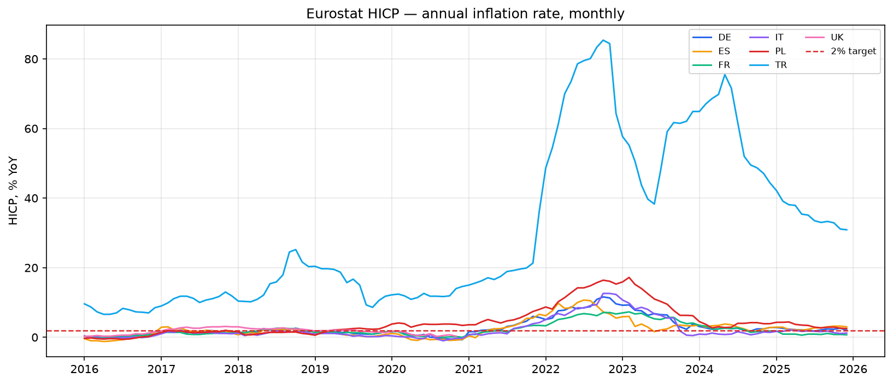

| geo   |   hicp_yoy_pct | as_of      |
|:------|---------------:|:-----------|
| UK    |            0.3 | 2020-11-01 |
| DE    |            2   | 2025-12-01 |
| PL    |            2.5 | 2025-12-01 |
| IT    |            1.2 | 2025-12-01 |
| ES    |            3   | 2025-12-01 |
| TR    |           30.9 | 2025-12-01 |
| FR    |            0.7 | 2025-12-01 |

## BIS credit-to-GDP gap (experimental source)
*Source: BIS — the Bank for International Settlements' own early-warning indicator for banking stress (gap vs long-term trend, percentage points). Readings above ~9pp historically preceded crises.*

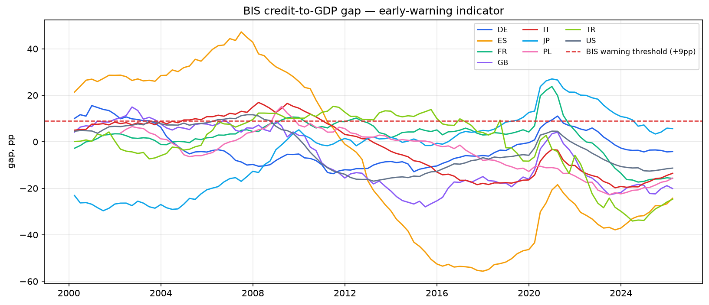

| geo   |   credit_gap_pp | as_of      |
|:------|----------------:|:-----------|
| IT    |        -14.4395 | 2025-12-31 |
| FR    |        -15.109  | 2025-12-31 |
| JP    |          6.7837 | 2025-12-31 |
| ES    |        -26.7769 | 2025-12-31 |
| GB    |        -17.8211 | 2025-12-31 |
| PL    |        -16.8492 | 2025-12-31 |
| DE    |         -3.9645 | 2025-12-31 |
| TR    |        -26.9071 | 2025-12-31 |
| US    |        -11.5378 | 2025-12-31 |

## OECD Composite Leading Indicator (experimental source)
*Source: OECD — amplitude-adjusted CLI, 100 = long-term trend. An independent 'is this economy turning?' cross-check on the scorecard.*

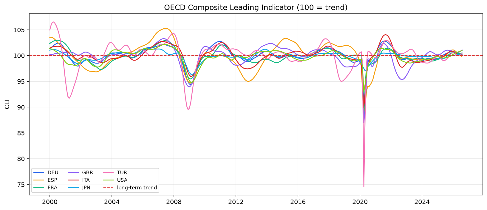

| geo   |      cli | signal      | as_of      |
|:------|---------:|:------------|:-----------|
| GBR   | 100.287  | above trend | 2026-06-01 |
| JPN   | 100.298  | above trend | 2026-06-01 |
| ITA   |  99.9858 | below trend | 2026-06-01 |
| FRA   | 100.56   | above trend | 2026-06-01 |
| ESP   | 100.433  | above trend | 2026-06-01 |
| DEU   | 100.72   | above trend | 2026-06-01 |
| TUR   | 100.053  | above trend | 2026-06-01 |
| USA   | 100.802  | above trend | 2026-06-01 |

## National Bank of Ukraine
*Source: NBU open data API — official UAH/USD rate. The one economy in the panel under acute stress, so it anchors the high end of the stress-index scale.*

- Latest official UAH/USD: **44.46** as of 2026-09-02 (4263 observations since 2015-01-01)
- Money supply M3: **+15.8% YoY** as of 2026-08-01

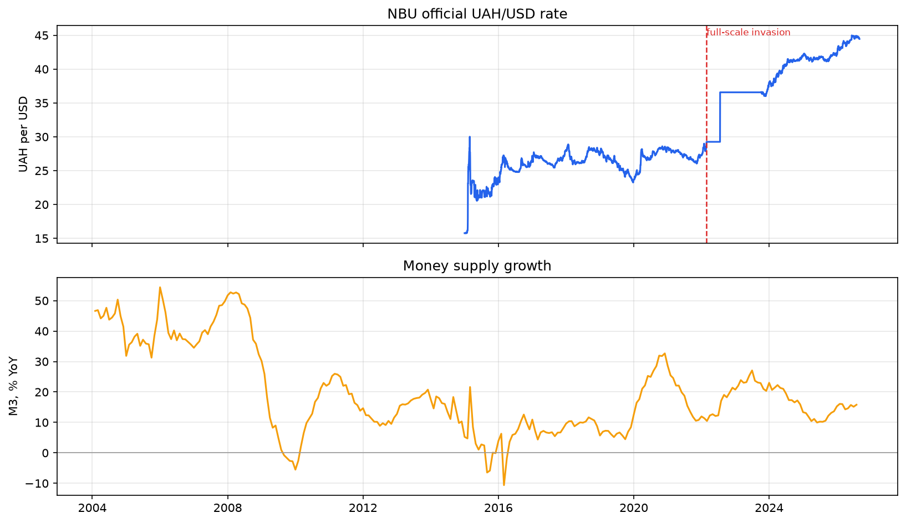

## Event study — policy decisions vs market moves
*Move measured from 3 trading days before to 3 after each FOMC/ECB decision (hardcoded official calendar — see ADR-0006). Curve moves in bp; FX in index points (start=100).*

| event          | date       |   before |   after |   move |
|:---------------|:-----------|---------:|--------:|-------:|
| FOMC           | 2024-01-31 |  -129    | -125    |   4    |
| FOMC           | 2024-03-20 |  -117    | -121    |  -4    |
| FOMC           | 2024-05-01 |   -79    |  -96    | -17    |
| FOMC           | 2024-06-12 |  -109    | -124    | -15    |
| FOMC           | 2024-07-31 |  -118    | -157    | -39    |
| FOMC           | 2024-09-18 |  -131    |  -97    |  34    |
| FOMC           | 2024-11-07 |   -34    |  -16    |  18    |
| FOMC           | 2024-12-18 |     6    |   23    |  17    |
| FOMC           | 2025-01-29 |    28    |   20    |  -8    |
| FOMC           | 2025-03-19 |    -2    |    1    |   3    |
| FOMC           | 2025-05-07 |     0    |    3    |   3    |
| FOMC           | 2025-06-18 |    -4    |   -8    |  -4    |
| FOMC           | 2025-07-30 |    -2    |  -13    | -11    |
| FOMC           | 2025-09-17 |    -2    |   15    |  17    |
| FOMC           | 2025-10-29 |     9    |   15    |   6    |
| FOMC           | 2025-12-10 |    43    |   53    |  10    |
| FOMC           | 2026-01-28 |    54    |   60    |   6    |
| FOMC           | 2026-03-18 |    56    |   60    |   4    |
| FOMC           | 2026-04-29 |    62    |   75    |  13    |
| FOMC           | 2026-06-17 |    70    |   65    |  -5    |
| FOMC           | 2026-07-29 |    73    |   79    |   6    |
| ECB vs EUR/USD | 2024-01-25 |    90.43 |   90.06 |  -0.37 |
| ECB vs EUR/USD | 2024-03-07 |    90.06 |   90.64 |   0.58 |
| ECB vs EUR/USD | 2024-04-11 |    89.87 |   88.33 |  -1.54 |
| ECB vs EUR/USD | 2024-06-06 |    90.03 |   89.1  |  -0.93 |
| ECB vs EUR/USD | 2024-07-18 |    90.57 |   90.18 |  -0.39 |
| ECB vs EUR/USD | 2024-09-12 |    91.7  |   92.49 |   0.8  |
| ECB vs EUR/USD | 2024-10-17 |    90.63 |   89.85 |  -0.78 |
| ECB vs EUR/USD | 2024-12-12 |    87.75 |   87.16 |  -0.59 |
| ECB vs EUR/USD | 2025-01-30 |    87.44 |   85.82 |  -1.62 |
| ECB vs EUR/USD | 2025-03-06 |    86.9  |   90.61 |   3.71 |
| ECB vs EUR/USD | 2025-04-17 |    94.47 |   94.46 |  -0.01 |
| ECB vs EUR/USD | 2025-06-05 |    94.82 |   94.9  |   0.08 |
| ECB vs EUR/USD | 2025-07-24 |    96.88 |   95.77 |  -1.11 |
| ECB vs EUR/USD | 2025-09-11 |    97.38 |   98.04 |   0.66 |
| ECB vs EUR/USD | 2025-10-30 |    96.65 |   95.42 |  -1.24 |
| ECB vs EUR/USD | 2025-12-18 |    97.59 |   97.87 |   0.27 |
| ECB vs EUR/USD | 2026-02-05 |    98.31 |   98.76 |   0.45 |
| ECB vs EUR/USD | 2026-03-19 |    95.31 |   96.09 |   0.78 |
| ECB vs EUR/USD | 2026-04-30 |    97.56 |   97.67 |   0.11 |
| ECB vs EUR/USD | 2026-06-11 |    95.82 |   96.27 |   0.45 |
| ECB vs EUR/USD | 2026-07-23 |    94.88 |   94.39 |  -0.49 |

## Nowcast (illustrative)

**10Y-3M spread — illustrative 5-step nowcast** (Holt exponential smoothing):

- last actual: **87.0 bp** (2026-09-01)
- 5-step forecast: **86.06 bp** (95% band 54.31 … 117.81)
- in-sample RMSE 7.24 vs naive-model RMSE 5.4 — the smoother barely beats naive; treat as illustrative.

*Not a trading model — a workflow demo with an explicit naive benchmark.*

**EUR/USD — illustrative 5-step nowcast** (Holt exponential smoothing):

- last actual: **1.16 ** (2026-09-01)
- 5-step forecast: **1.17 ** (95% band 1.13 … 1.2)
- in-sample RMSE 0.01 vs naive-model RMSE 0.01 — the smoother barely beats naive; treat as illustrative.

*Not a trading model — a workflow demo with an explicit naive benchmark.*

## Cross-indicator correlations
*Pearson correlation of daily changes on overlapping dates (levels of trending series would give spurious correlations).*

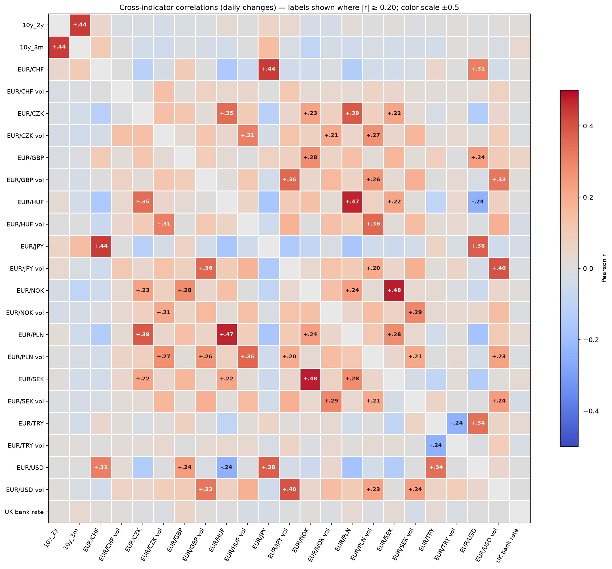

**Strongest co-movements:**

| pair                      |   corr |
|:--------------------------|-------:|
| EUR/NOK × EUR/SEK         |   0.48 |
| EUR/HUF × EUR/PLN         |   0.47 |
| 10y_2y × 10y_3m           |   0.44 |
| EUR/CHF × EUR/JPY         |   0.44 |
| EUR/JPY vol × EUR/USD vol |   0.4  |

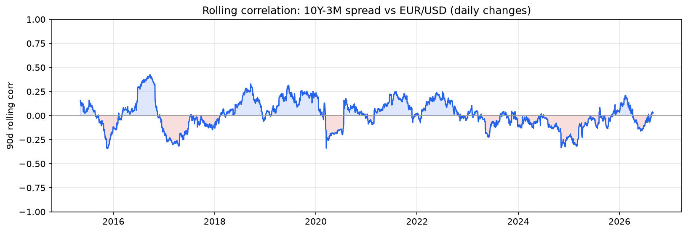

## Toy signal backtest (illustrative — read the caveats)
*Strategy: hold a simulated constant-maturity 10Y note; switch to 3M-bill carry while the 10Y-3M spread is inverted. Signal lagged one day. Bond returns are a duration approximation (r = carry - D*dy) with no convexity, costs, or taxes. This demonstrates the tear-sheet workflow, not an investable strategy (see ADR-0007).*

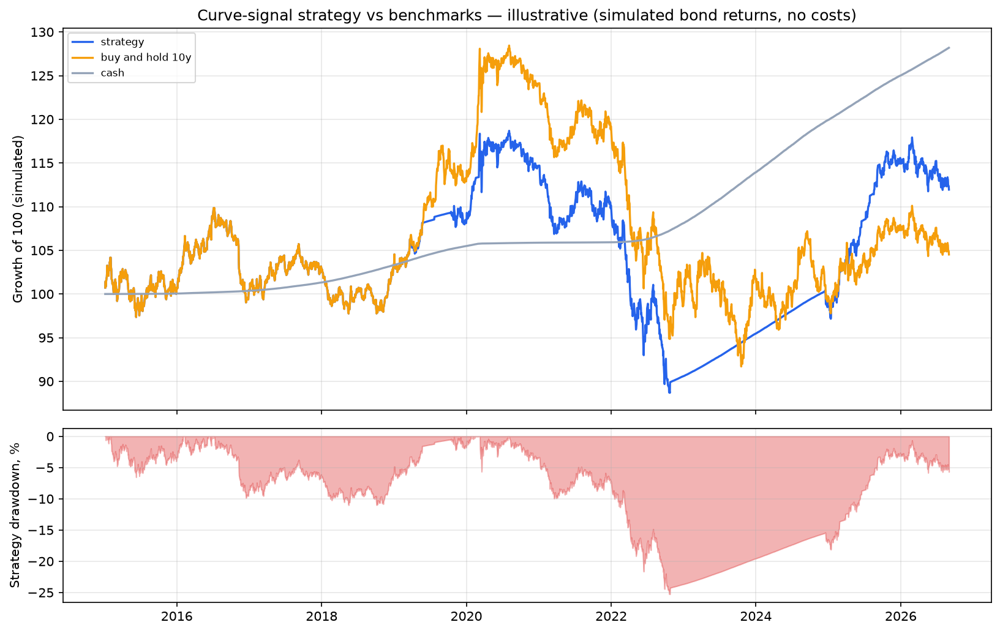

|                        |   CAGR_pct |   ann_vol_pct |   sharpe |   max_drawdown_pct |   total_return_pct |
|:-----------------------|-----------:|--------------:|---------:|-------------------:|-------------------:|
| curve-signal strategy  |       0.98 |          6    |     0.19 |             -25.28 |              11.95 |
| buy & hold 10Y (proxy) |       0.38 |          7.57 |     0.09 |             -28.61 |               4.52 |
| cash (3M bills)        |       2.17 |          0.12 |    17.34 |               0    |              28.19 |

- Sample: 2917 trading days; time in cash: **25.3%**

## Real (PPP-adjusted) exchange rates
*ECB nominal rates deflated by relative CPI (World Bank), Germany as euro-area proxy. The gap between nominal and real change is the two economies' inflation differential.*

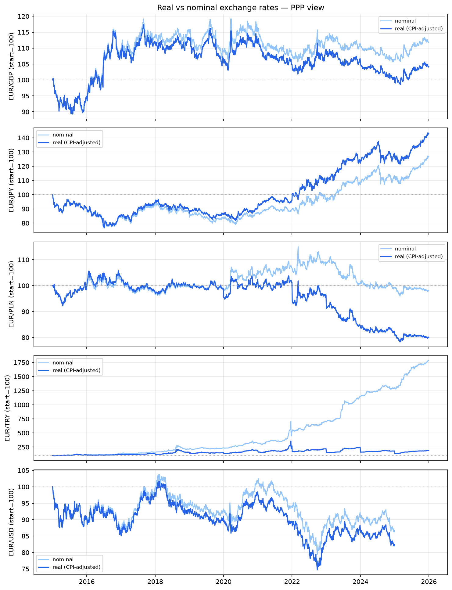

| currency   | period                  |   nominal_change_pct |   real_change_pct |   inflation_gap_pp |
|:-----------|:------------------------|---------------------:|------------------:|-------------------:|
| GBP        | 2015-01-02 → 2025-12-31 |                 11.9 |               4.2 |               -7.7 |
| JPY        | 2015-01-02 → 2025-12-31 |                 26.8 |              43   |               16.2 |
| PLN        | 2015-01-02 → 2025-12-31 |                 -2   |             -20   |              -18.1 |
| TRY        | 2015-01-02 → 2025-12-31 |               1681.9 |              87.5 |            -1594.4 |
| USD        | 2015-01-02 → 2024-12-31 |                -13.7 |             -18   |               -4.3 |

## Debt sustainability — the r vs g check
*World Bank data. Screening heuristic only: no primary-balance path or maturity structure. r > g with high debt = the ratio snowballs without surpluses.*

| country        |   govt_debt_gdp_pct |   gdp_growth_pct |   real_interest_pct |   r_minus_g_pp | verdict                       |
|:---------------|--------------------:|-----------------:|--------------------:|---------------:|:------------------------------|
| United Kingdom |               130.7 |              1.4 |                -1.1 |           -2.5 | g>r — growing out             |
| United States  |               115.8 |              2.2 |                -1.3 |           -3.5 | g>r — growing out             |
| Spain          |               105.6 |              2.8 |               nan   |          nan   | insufficient data             |
| Italy          |                77.3 |              0.5 |                 2   |            1.5 | snowball risk (r>g, debt>60%) |
| Poland         |                60.5 |              3.6 |               nan   |          nan   | insufficient data             |
| Ukraine        |                58.7 |              1.8 |                 4.6 |            2.8 | r>g — watch                   |
| Turkiye        |                26.6 |              3.6 |               nan   |          nan   | insufficient data             |
| Germany        |                20.9 |              0.2 |               nan   |          nan   | insufficient data             |
| France         |               nan   |              0.8 |               nan   |          nan   | insufficient data             |
| Japan          |               nan   |              1.2 |                 1   |           -0.2 | g>r — growing out             |

## Run history (DuckDB)
*22 metrics appended this run; 33 runs recorded in `data/history.duckdb`. Each refresh appends a dated snapshot rather than overwriting the last one.*

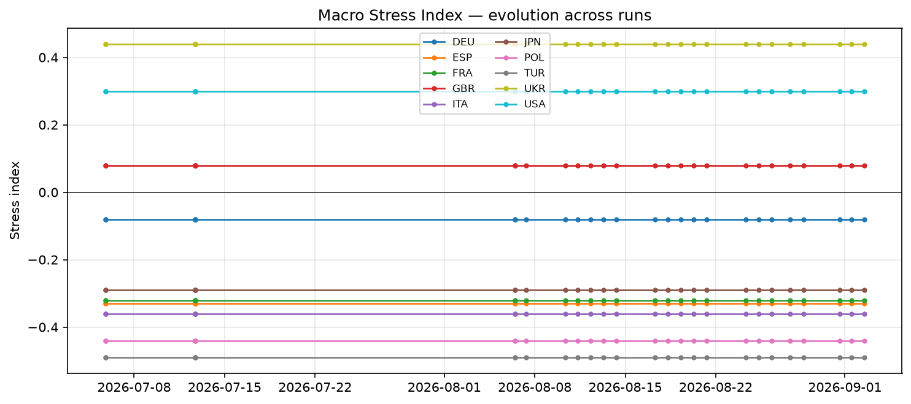

---
*Sections skipped this run (source or prerequisite unavailable): FRED. Re-run with `--refresh` when online.*